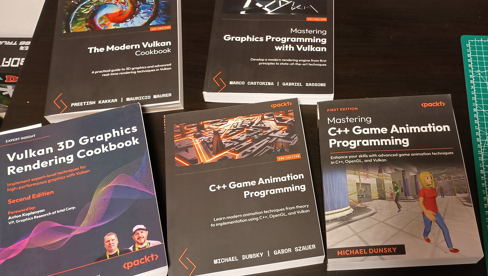

## Considerations

###  Motivation

I've loved graphics programming since I started doing it back in college.
However, as I didn't make a career out of it, I ended up letting some of it slip away from me.
Going through the Learn OpenGL lessons was a great crash course to get me back into it,
as well as, hopefully, a good portfolio piece to show off.

Eventually, I would like to make graphics into a career.
This project was a good chance to both remember old skills, as well as catch up to the latest industry trends.

### What did I learn?

First off, most of the math was a just a refresher, but a much needed one.
I took all the usual upper-division math courses in college,
but as I haven't really needed that math as a web developer, I'd grown a bit fuzzy on some of the details.
This project, as well as a couple textbooks, helped me remember all that old linear algebra.
Now I just need a project to help me brush off partial differential equations
(I suppose I'll have to add an ocean simulation to the old to-do list).

Most of the basic and advanced lighting also falls into the category of "things I used to know".
This includes ADS materials, the Phong and Blinn-Phong lighting models, textures, normal maps, etc.

What was new to me was mostly just dealing with the GPU.
Back in the day, I'd mostly learned graphics through working on CPU renderers,
with the occasional foray into graphics "libraries" that handled most of the graphics APIs for me
(Ogre3D, Monogame, Raylib, etc.).
Learning OpenGL meant learning a lot more about how GPUs work, and how to work with them.
I'm well aware that OpenGL barely scratches the surface of modern GPUs, however.
I'll have to learn more when I start playing with Vulkan.

PBR - or Physically-Based Rendering - lighting models were new to me, as well.
I'd read about them, but never really implemented one before.

Text rendering is also something I hadn't gone into before, so getting the titles and sub-titles to render was a treat.
There is, of course, a whole lot of room for improvement on my text rendering for this project,
but for this project, I'm just happy to have it working.

### Why one single application?

The Learn OpenGL repository has a separate application for every chapter and exercise,
which is certainly one way to keep concerns separated.
However, I found it a bit cumbersome to manage the plethora of build tasks that would entail,
so I opted to have a single application that could display everything.

This did lead to the awkward problem of what to call these chapter/exercise implementations.
I wanted to use the word "scene", but I had already given that name up to the "scenes" returned by the object
file parser.
I ended up just sticking the word "scene" into a thesaurus and picking my favorite result: "tableau".
This proved to be an excellent choice for a word that I would have to type over and over;
I certainly didn't misspell it constantly.

### Why Odin and not C++?

Truth be told, I actually did start out with C++, just like the website.
However, I found myself falling into the trap of just rewriting the code exactly as I saw it without
properly understanding it.
Additionally, while I'm pretty comfortable with C++ the language,
I was getting frustrated with the build systems around it.
The guide suggests CMake, but holy hell do I hate using CMake.
I've used  better build tools in other projects, such as Premake and Xmake, and I suppose I could have used those.
However, by the time I got back to doing this project, I'd already found the Odin programming language,
and I enjoy using it _much_ more than C++.
I decided to just start the entire thing over from scratch with Odin.
It was fairly easy to do, as Odin has built-in support for OpenGL and GLFW.
It also meant that I had to actually understand the code, in order to translate it into a new language.
I feel like this really helped me with the learning process.

### Any regrets?

The name "tableau", for one.

I wrote some nifty logic for re-using shaders between tableaus,
but it did become kind of tedious to use after I had over 100 shaders.
It also lacks any partial cleanup code, it could have been a problem if I had more shaders.

Really, though, the biggest regret is just not having kept up with graphics programming for
all these years in the first place.
It's a lot of fun, and I could have made a career out of it and been so much better at it by now.
Oh well, better late than never.

### Anything left on the cutting room floor?

Obviously, there were a lot of things that would have been neat to do,
I have to call this project "done" and move on to something new eventually.

Here's a non exhaustive list of things I thought about doing:
    - All of the guest chapters from Learn OpenGL.
    - The rest of the exercises from the textbook, particularly those about compute shaders and ray tracing.
    - Improve the text rendering engine, such as generating a proper atlas or saving entire strings as textures.
    - A nicer UI, or perhaps implement Dear Imgui.

The main reason I'm willing to cut most of these is that I'm going to end up implementing them as part of
other projects in the future, so I'll still end up learning them eventually.

### What's next?

Learning Vulkan is the next step. I've got a stack of books all about Vulkan that weigh more than my toddler,
and I can't wait to start going through them.

My main focus will be on gaining a better understanding of how the GPU works, and how to work with it.
A Vulkan-based renderer seems to be the ideal battleground for mastering this topic.

After that, I've got another toddler's worth of books to start pulling ideas from, such as the GPU Gems/Pro/Zen series.
The skies the limit.

